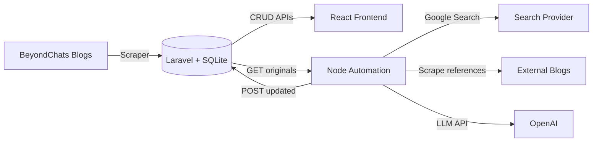

# BeyondChats Assignment

Full-stack solution with three phases:
- Phase 1: Laravel APIs + scraper to ingest BeyondChats blog posts.
- Phase 2: Node.js automation to search, scrape references, and generate updated articles via LLM.
- Phase 3: React frontend to display original and updated articles.

## Repository Structure
- `backend/`: Laravel 12 API + SQLite persistence + scraper command.
- `automation/`: Node.js script to generate updated articles and publish them via the API.
- `frontend/`: React (Vite) UI to show original and updated articles.

## Prerequisites
- PHP 8.2+, Composer
- Node.js 18+ (npm)
- SQLite (bundled with PHP builds on most setups)

## Backend Setup (Laravel)
```bash
cd backend
composer install
copy .env.example .env
php artisan key:generate
php artisan migrate
php artisan articles:scrape
php artisan serve
```

API endpoints:
- `GET /api/articles?type=original&withUpdated=true`
- `GET /api/articles/{id}`
- `POST /api/articles`
- `PUT /api/articles/{id}`
- `DELETE /api/articles/{id}`
- `POST /api/articles/scrape`

## Automation Script (Phase 2)
```bash
cd automation
npm install
copy .env.example .env
npm run start
```

Required `.env` values:
- `OPENAI_API_KEY` or `HF_API_KEY`: LLM API key.
- `HF_MODEL`: Optional Hugging Face model name (defaults to `HuggingFaceH4/zephyr-7b-beta`).
- `SEARCH_PROVIDER`: `serper`, `serpapi`, or `html`.
- `SERPER_API_KEY` or `SERPAPI_API_KEY`: Search provider key.
- `API_BASE_URL`: Defaults to `http://localhost:8000/api`.

## Frontend (Phase 3)
```bash
cd frontend
npm install
```

Create `.env` inside `frontend/`:
```bash
VITE_API_BASE_URL=http://localhost:8000/api
```

Run the UI:
```bash
npm run dev
```

## Architecture / Data Flow


## Live Link
- Frontend: <add deployment URL>
