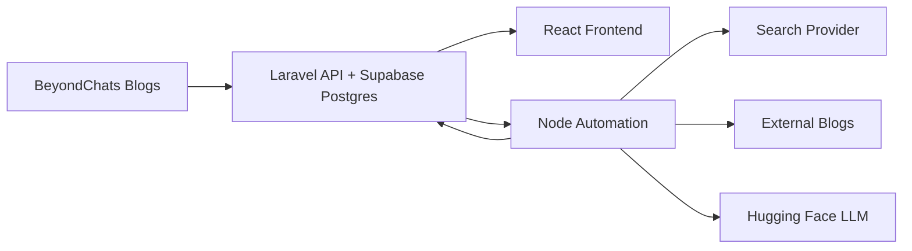

# BeyondChats Assignment

Full-stack solution with three phases:
- Phase 1: Laravel APIs + scraper to ingest BeyondChats blog posts.
- Phase 2: Node.js automation to search, scrape references, and generate updated articles via LLM (Hugging Face).
- Phase 3: React frontend to display original and updated articles.

## Repository Structure
- `backend/`: Laravel 12 API + Supabase Postgres + scraper command.
- `automation/`: Node.js script to generate updated articles and publish them via the API.
- `frontend/`: React (Vite) UI to show original and updated articles.

## Prerequisites
- PHP 8.2+, Composer
- Node.js 20+ (npm)
- Supabase Postgres project (or any Postgres database)

## Backend Setup (Laravel)
```bash
cd backend
composer install
copy .env.example .env
php artisan key:generate
```

Configure Supabase (pooler) in `backend/.env`:
```bash
DB_CONNECTION=pgsql
DB_HOST=aws-1-ap-northeast-2.pooler.supabase.com
DB_PORT=6543
DB_DATABASE=postgres
DB_USERNAME=postgres.<project-ref>
DB_PASSWORD=your-db-password
DB_SSLMODE=require
```

Then run:
```bash
php artisan migrate
php artisan articles:scrape --limit=5
php artisan serve
```

## Deployment (Render)
This repo includes a root-level `Dockerfile` so the backend + automation run together.

Render settings:
- Root directory: repo root (contains `Dockerfile`)
- Environment: Docker
- Add env vars:
  - `APP_KEY` (generate locally with `php artisan key:generate --show`)
  - `APP_ENV=production`
  - `APP_DEBUG=false`
  - `APP_URL=https://<your-render-service>.onrender.com`
  - `DB_CONNECTION=pgsql`
  - `DB_HOST=<supabase pooler host>`
  - `DB_PORT=6543`
  - `DB_DATABASE=postgres`
  - `DB_USERNAME=postgres.<project-ref>`
  - `DB_PASSWORD=<your-db-password>`
  - `DB_SSLMODE=require`
  - `AUTOMATION_NODE_BINARY=node`
  - `AUTOMATION_WORKDIR=../automation`
  - `AUTOMATION_SCRIPT=index.js`
  - `API_BASE_URL=http://127.0.0.1:10000/api`
  - `HF_API_KEY`
  - `HF_MODEL=google/gemma-2-2b-it`
  - `HF_BASE_URL=https://router.huggingface.co/v1/chat/completions`

API endpoints:
- `GET /api/articles?type=original&withUpdated=true`
- `GET /api/articles/{id}`
- `POST /api/articles`
- `PUT /api/articles/{id}`
- `DELETE /api/articles/{id}`
- `POST /api/articles/scrape`

## Automation Script (Phase 2)
```bash
cd automation
npm install
copy .env.example .env
npm run start
```

Required `.env` values:
- `HF_API_KEY`: LLM API key.
- `HF_MODEL`: Optional Hugging Face chat model name (defaults to `google/gemma-2-2b-it`).
- `HF_BASE_URL`: Optional override for Hugging Face router endpoint (OpenAI-compatible, default `https://router.huggingface.co/v1/chat/completions`).
- `SEARCH_PROVIDER`: `serper`, `serpapi`, or `html`.
- `SERPER_API_KEY` or `SERPAPI_API_KEY`: Search provider key.
- `API_BASE_URL`: Defaults to `http://localhost:8000/api`.

You can also trigger automation from the backend:
- `POST /api/automation/run` (used by the frontend "Generate updated articles" button).
- `GET /api/automation/status` (polling endpoint for progress updates).

## Frontend (Phase 3)
```bash
cd frontend
npm install
```

Create `.env` inside `frontend/`:
```bash
VITE_API_BASE_URL=http://localhost:8000/api
```

For production builds:
```bash
VITE_API_BASE_URL=https://beyondchats-assignment-igd3.onrender.com/api
```

Run the UI:
```bash
npm run dev
```

## Architecture / Data Flow


## Live Link
- Frontend: https://beyond-chats-assignment-kappa.vercel.app/
- Backend: https://beyondchats-assignment-igd3.onrender.com
