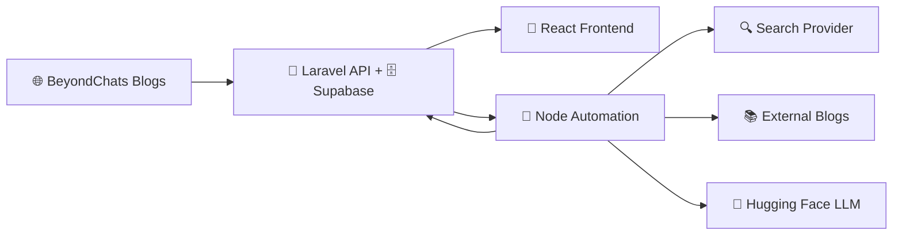

# ✨ AI Article Enhancer

> 🚀 A powerful full-stack solution that automatically enhances blog articles using AI

[](https://beyond-chats-assignment-kappa.vercel.app/)
[](https://beyondchats-assignment-igd3.onrender.com)
[](https://laravel.com)
[](https://react.dev)
[](https://nodejs.org)

## 📋 Table of Contents
- [Overview](#-overview)
- [Features](#-features)
- [Repository Structure](#-repository-structure)
- [Prerequisites](#-prerequisites)
- [Quick Start](#-quick-start)
- [Backend Setup](#-backend-setup-laravel)
- [Automation Script](#-automation-script-phase-2)
- [Frontend Setup](#-frontend-setup-phase-3)
- [Deployment](#-deployment-render)
- [API Endpoints](#-api-endpoints)
- [Architecture](#-architecture--data-flow)
- [Live Links](#-live-links)

## 🎯 Overview

AI Article Enhancer is a comprehensive three-phase solution that: 

### 📌 Phase 1: Data Ingestion
🔧 Laravel APIs + Web scraper to ingest BeyondChats blog posts into Supabase Postgres

### 📌 Phase 2: AI Enhancement
🤖 Node.js automation that searches references, scrapes content, and generates enhanced articles using LLM (Hugging Face)

### 📌 Phase 3: Interactive UI
💎 React frontend to display and compare original vs.  AI-enhanced articles

## ✨ Features

- 🔄 **Automated Scraping**: Extract blog posts from BeyondChats
- 🧠 **AI-Powered Enhancement**:  Leverage Hugging Face LLMs for content improvement
- 🔍 **Smart Search**: Multiple search providers (Serper, SerpAPI)
- 📊 **Real-time Progress**: Track automation status with polling
- 🎨 **Modern UI**: Clean React interface with Vite
- 🗄️ **Scalable Database**: Supabase Postgres backend
- 🚀 **Production Ready**: Dockerized deployment on Render

## 📁 Repository Structure

```
AI-Article-Enhancer/
├── 📂 backend/          # Laravel 12 API + Supabase Postgres + Scraper
├── 📂 automation/       # Node.js script for AI article generation
├── 📂 frontend/         # React (Vite) UI application
└── 📄 Dockerfile        # Production deployment configuration
```

## 🔧 Prerequisites

Before getting started, ensure you have: 

- ✅ PHP 8.2+ with Composer
- ✅ Node.js 20+ with npm
- ✅ Supabase Postgres project (or any Postgres database)
- ✅ Hugging Face API key
- ✅ Search API key (Serper or SerpAPI)

## 🚀 Quick Start

### Clone the Repository

```bash
git clone https://github.com/AdiCoder33/AI-Article-Enhancer.git
cd AI-Article-Enhancer
```

## 🔙 Backend Setup (Laravel)

### 1️⃣ Install Dependencies

```bash
cd backend
composer install
```

### 2️⃣ Configure Environment

```bash
copy .env.example .env
php artisan key:generate
```

### 3️⃣ Setup Supabase Connection

Edit `backend/.env` with your Supabase credentials:

```env
DB_CONNECTION=pgsql
DB_HOST=aws-1-ap-northeast-2.pooler.supabase.com
DB_PORT=6543
DB_DATABASE=postgres
DB_USERNAME=postgres. <project-ref>
DB_PASSWORD=your-db-password
DB_SSLMODE=require
```

### 4️⃣ Run Migrations & Start Server

```bash
php artisan migrate
php artisan articles:scrape --limit=5
php artisan serve
```

✅ Backend running at: `http://localhost:8000`

## 🤖 Automation Script (Phase 2)

### 1️⃣ Install Dependencies

```bash
cd automation
npm install
```

### 2️⃣ Configure Environment

```bash
copy .env.example .env
```

Required environment variables: 

```env
# 🔑 AI Configuration
HF_API_KEY=your-huggingface-api-key
HF_MODEL=google/gemma-2-2b-it
HF_BASE_URL=https://router.huggingface.co/v1/chat/completions

# 🔍 Search Provider (choose one)
SEARCH_PROVIDER=serper          # Options: serper, serpapi, html
SERPER_API_KEY=your-serper-key  # If using Serper
SERPAPI_API_KEY=your-serpapi-key # If using SerpAPI

# 🌐 API Configuration
API_BASE_URL=http://localhost:8000/api
```

### 3️⃣ Run Automation

```bash
npm run start
```

### 🎮 Trigger from Backend

You can also trigger automation via API:

- **🚀 Start Automation**: `POST /api/automation/run`
- **📊 Check Status**: `GET /api/automation/status`

## 💎 Frontend Setup (Phase 3)

### 1️⃣ Install Dependencies

```bash
cd frontend
npm install
```

### 2️⃣ Configure Environment

Create `.env` inside `frontend/`:

**For local development:**
```env
VITE_API_BASE_URL=http://localhost:8000/api
```

**For production:**
```env
VITE_API_BASE_URL=https://beyondchats-assignment-igd3.onrender.com/api
```

### 3️⃣ Run Development Server

```bash
npm run dev
```

✅ Frontend running at: `http://localhost:5173`

### 4️⃣ Build for Production

```bash
npm run build
```

## 🐳 Deployment (Render)

This repository includes a root-level `Dockerfile` for easy deployment.

### 🔧 Render Configuration

**Service Settings:**
- **Root Directory**: Repository root (contains `Dockerfile`)
- **Environment**: Docker
- **Port**: 10000 (default)

### 🌐 Environment Variables

Add these environment variables in Render:

```env
# 🔐 Laravel Configuration
APP_KEY=base64:your-app-key-from-php-artisan-key:generate
APP_ENV=production
APP_DEBUG=false
APP_URL=https://<your-render-service>.onrender.com

# 🗄️ Database Configuration
DB_CONNECTION=pgsql
DB_HOST=<supabase-pooler-host>
DB_PORT=6543
DB_DATABASE=postgres
DB_USERNAME=postgres.<project-ref>
DB_PASSWORD=<your-db-password>
DB_SSLMODE=require

# 🤖 Automation Configuration
AUTOMATION_NODE_BINARY=node
AUTOMATION_WORKDIR=../automation
AUTOMATION_SCRIPT=index.js
API_BASE_URL=http://127.0.0.1:10000/api

# 🧠 AI Configuration
HF_API_KEY=your-huggingface-api-key
HF_MODEL=google/gemma-2-2b-it
HF_BASE_URL=https://router.huggingface.co/v1/chat/completions
```

## 📡 API Endpoints

| Method | Endpoint | Description |
|--------|----------|-------------|
| 🔍 `GET` | `/api/articles?type=original&withUpdated=true` | Get all articles |
| 📄 `GET` | `/api/articles/{id}` | Get single article |
| ➕ `POST` | `/api/articles` | Create new article |
| ✏️ `PUT` | `/api/articles/{id}` | Update article |
| 🗑️ `DELETE` | `/api/articles/{id}` | Delete article |
| 🌐 `POST` | `/api/articles/scrape` | Trigger scraper |
| 🚀 `POST` | `/api/automation/run` | Start AI enhancement |
| 📊 `GET` | `/api/automation/status` | Get automation status |

## 🏗️ Architecture / Data Flow



### 🔄 Process Flow

1. **📥 Scraping**:  Laravel scraper fetches original articles from BeyondChats
2. **💾 Storage**: Articles stored in Supabase Postgres database
3. **🔍 Research**: Node automation searches for relevant references
4. **🌐 Extraction**: External blog content scraped for context
5. **🧠 Enhancement**:  Hugging Face LLM generates improved articles
6. **✅ Publishing**: Enhanced articles saved back to database
7. **👀 Display**: React frontend shows original vs. enhanced comparison

## 🌍 Live Links

| Service | URL | Status |
|---------|-----|--------|
| 🎨 **Frontend** | [https://beyond-chats-assignment-kappa.vercel.app/](https://beyond-chats-assignment-kappa.vercel.app/) |  |
| 🔧 **Backend API** | [https://beyondchats-assignment-igd3.onrender.com](https://beyondchats-assignment-igd3.onrender. com) |  |

## 📝 License

This project is part of an assignment for BeyondChats. 

## 👨‍💻 Author

**AdiCoder33**

- GitHub: [@AdiCoder33](https://github.com/AdiCoder33)

---

<p align="center">
  Made with ❤️ using Laravel, React, and AI
</p>
